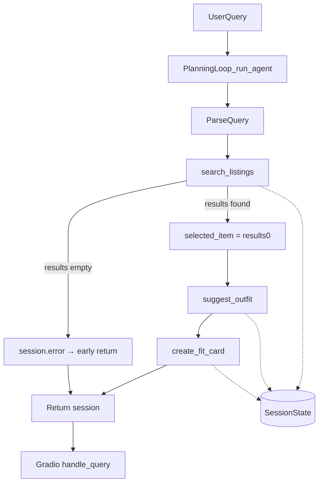

# FitFindr — planning.md

> Complete this document before writing any implementation code.
> Your spec and agent diagram are what you'll use to direct AI tools (Claude, Copilot, etc.) to generate your implementation — the more specific they are, the more useful the generated code will be.
> Your planning.md will be reviewed as part of your submission.
> Update it before starting any stretch features.

---

## Tools

List every tool your agent will use. For each tool, fill in all four fields.
You must have at least 3 tools. The three required tools are listed — add any additional tools below them.

### Tool 1: search_listings

**What it does:**
Searches the 40-item mock listings dataset for secondhand items matching the user's description, optional size, and optional price ceiling. Returns matching listing dicts sorted by keyword relevance (best match first).

**Input parameters:**
- `description` (str): Keywords describing what the user wants (e.g., `"vintage graphic tee"`). Tokenized and matched against listing title, description, style_tags, and category.
- `size` (str | None): Size filter string, or `None` to skip. Case-insensitive substring match (e.g., `"M"` matches `"S/M"`).
- `max_price` (float | None): Maximum price inclusive, or `None` to skip price filtering.

**What it returns:**
A `list[dict]` of matching listing objects, sorted by relevance score (highest first). Each dict contains: `id`, `title`, `description`, `category`, `style_tags` (list[str]), `size`, `condition`, `price` (float), `colors` (list[str]), `brand` (str | None), `platform` (str). Returns an empty list `[]` if no listings match — never raises an exception.

**What happens if it fails or returns nothing:**
The agent sets `session["error"]` to a helpful message such as: *"No listings found for 'designer ballgown' in size XXS under $5. Try broadening your search — remove the size filter, raise your price limit, or use different keywords."* The agent returns early and does **not** call `suggest_outfit` or `create_fit_card`.

---

### Tool 2: suggest_outfit

**What it does:**
Given a specific thrifted listing and the user's wardrobe, calls the Groq LLM (`llama-3.3-70b-versatile`) to suggest 1–2 complete outfit combinations using pieces from the wardrobe, or general styling advice if the wardrobe is empty.

**Input parameters:**
- `new_item` (dict): A listing dict from `search_listings` — the item the user is considering buying. Must include at least `title`, `category`, `style_tags`, `colors`, `price`, `platform`.
- `wardrobe` (dict): User's wardrobe with an `items` key containing a list of wardrobe item dicts. Each item has `id`, `name`, `category`, `colors`, `style_tags`, and optional `notes`. May be empty (`items: []`).

**What it returns:**
A non-empty `str` with outfit suggestions. If the wardrobe has items, the string names specific wardrobe pieces and describes how to style them with the new item. If the wardrobe is empty, the string offers general pairing advice (what item types and vibes work with the new piece). Never returns an empty string or raises an exception.

**What happens if it fails or returns nothing:**
If the wardrobe is empty, the tool does **not** fail — it returns general styling advice instead of wardrobe-specific combos. If the Groq API call fails, the tool returns a fallback string with basic styling tips derived from `new_item`'s `style_tags` and `category` (e.g., *"This vintage graphic tee pairs well with relaxed denim and chunky sneakers for a 90s grunge look."*).

---

### Tool 3: create_fit_card

**What it does:**
Calls the Groq LLM (`llama-3.3-70b-versatile`, temperature 0.95) to generate a short, casual, shareable outfit caption — the kind someone would post on Instagram or TikTok about their thrift find.

**Input parameters:**
- `outfit` (str): The outfit suggestion string from `suggest_outfit`. Must be non-empty for a successful caption.
- `new_item` (dict): The listing dict for the thrifted item, used for title, price, and platform in the caption.

**What it returns:**
A `str` of 2–4 sentences usable as a social media caption. Mentions the item name, price, and platform naturally once each. Sounds casual and authentic, not like a product description. Output varies across runs for the same inputs (high temperature).

**What happens if it fails or returns nothing:**
If `outfit` is empty or whitespace-only, returns the error message string: *"Can't create a fit card without an outfit suggestion. Please run outfit styling first."* — does not raise an exception. If the Groq API call fails, returns a simple template caption using item fields.

---

### Additional Tools (if any)

None.

---

## Planning Loop

**How does your agent decide which tool to call next?**

The agent uses a sequential planning loop with conditional early exit after search. It does **not** call all three tools unconditionally.

1. **Initialize:** Create session via `_new_session(query, wardrobe)`.
2. **Parse query:** Extract `description`, `size`, and `max_price` from the natural language query using **regex** (not LLM parsing — keeps search fast and deterministic). Patterns: `under $N` / `below $N` for price; `(?:size|in)+` chains for size (e.g., `in size M` → `M`); wardrobe/style context phrases stripped from description. Store in `session["parsed"]`.
3. **Search:** Call `search_listings(description, size, max_price)`. Store results in `session["search_results"]`.
   - **If `search_results` is empty:** Set `session["error"]` to an actionable message suggesting the user broaden keywords, remove size filter, or raise price. **Return session immediately.** Do not call `suggest_outfit` or `create_fit_card`.
   - **If results exist:** Set `session["selected_item"] = search_results[0]` (top match by relevance).
4. **Suggest outfit:** Call `suggest_outfit(session["selected_item"], session["wardrobe"])`. Store result in `session["outfit_suggestion"]`.
5. **Create fit card:** Call `create_fit_card(session["outfit_suggestion"], session["selected_item"])`. Store result in `session["fit_card"]`.
6. **Return:** Return the completed session dict.

The loop branches on step 3: empty search results terminate the interaction early. Steps 4–5 only run when a valid item was found.

---

## State Management

**How does information from one tool get passed to the next?**

All state lives in a single `session` dict created at the start of each interaction. The planning loop reads from and writes to this dict — no global variables or re-parsing between steps.

| Field | Set when | Used by |
|-------|----------|---------|
| `query` | Session init | Reference only |
| `parsed` | After query parsing | `search_listings()` inputs |
| `search_results` | After search | Selecting `selected_item` |
| `selected_item` | After search (top result) | `suggest_outfit()`, `create_fit_card()` |
| `wardrobe` | Session init (passed in) | `suggest_outfit()` |
| `outfit_suggestion` | After suggest_outfit | `create_fit_card()` |
| `fit_card` | After create_fit_card | Final output |
| `error` | On early termination | UI error display |

Example flow: `search_listings` returns `lst_002` as top hit → stored as `session["selected_item"]` → that exact dict is passed to `suggest_outfit(new_item=session["selected_item"], ...)` → the returned string is stored as `session["outfit_suggestion"]` → passed to `create_fit_card(outfit=session["outfit_suggestion"], new_item=session["selected_item"])`.

---

## Error Handling

For each tool, describe the specific failure mode you're handling and what the agent does in response.

| Tool | Failure mode | Agent response |
|------|-------------|----------------|
| search_listings | No results match the query | Agent sets `session["error"]` to: *"No listings found for '{description}'{size_msg}{price_msg}. Try broadening your search — remove the size filter, raise your price limit, or use different keywords like 'tee' instead of 'graphic tee'."* Returns session early. `outfit_suggestion` and `fit_card` remain `None`. UI shows error in first panel only. |
| suggest_outfit | Wardrobe is empty | Not treated as an error. Tool returns general styling advice (what item types pair well, what vibe suits the piece). Agent continues to `create_fit_card` normally. |
| create_fit_card | Outfit input is missing or incomplete | Tool returns: *"Can't create a fit card without an outfit suggestion. Please run outfit styling first."* Agent stores this string in `session["fit_card"]` so the user sees the message in the fit card panel. |

---

## Architecture

```
User query
    │
    ▼
Planning Loop (run_agent)
    │
    ├─► Parse query → session["parsed"]
    │
    ├─► search_listings(description, size, max_price)
    │       │
    │       ├── results=[] ──► session["error"] = helpful msg ──► RETURN session
    │       │
    │       └── results=[item, ...]
    │               │
    │           session["search_results"] = results
    │           session["selected_item"] = results[0]
    │               │
    ├─► suggest_outfit(selected_item, wardrobe)
    │       │
    │   session["outfit_suggestion"] = "..."
    │       │
    └─► create_fit_card(outfit_suggestion, selected_item)
            │
        session["fit_card"] = "..."
            │
            ▼
        RETURN session
            │
            ▼
    Gradio UI (handle_query) maps session → 3 output panels
```



---

## AI Tool Plan

**Milestone 3 — Individual tool implementations:**

- **Tool:** Cursor AI (Claude)
- **Input:** Tool 1 spec block from this planning.md (inputs, return value, failure mode, scoring algorithm) plus the `search_listings` stub in `tools.py` and `load_listings()` from `utils/data_loader.py`.
- **Expected output:** Implementation of `search_listings()` with price/size filtering and keyword scoring.
- **Verification:** Run 3 test queries manually: (1) `"vintage graphic tee"` with `max_price=50` → non-empty results, (2) `"designer ballgown"` with `size="XXS"`, `max_price=5` → empty list, (3) `"jacket"` with `max_price=10` → all results have `price <= 10`. Then run pytest.

For `suggest_outfit` and `create_fit_card`, same approach — paste Tool 2/3 spec blocks, verify empty wardrobe handling and empty outfit guard before wiring into agent.

**Milestone 4 — Planning loop and state management:**

- **Tool:** Cursor AI (Claude)
- **Input:** Architecture diagram, Planning Loop section, State Management section, and `run_agent()` TODO in `agent.py`.
- **Expected output:** Full `run_agent()` implementation with conditional branching on empty search results and session state passing.
- **Verification:** Run `python agent.py` — happy path prints title/outfit/fit card; no-results path prints error message and leaves `fit_card` as None. Print `session["selected_item"]` and confirm it's the same dict passed to `suggest_outfit`.

---

## A Complete Interaction (Step by Step)

Write out what a full user interaction looks like from start to finish — tool call by tool call. Use a specific example query.

FitFindr takes a natural language shopping query, searches mock listings, styles the top result against the user's wardrobe, and generates a shareable fit card. Each tool runs only when the previous step succeeds — if search returns nothing, the agent stops and tells the user what to try differently rather than calling outfit or fit card tools with empty input.

**Example user query:** "I'm looking for a vintage graphic tee under $30. I mostly wear baggy jeans and chunky sneakers. What's out there and how would I style it?"

**Step 1:**
The agent parses the query into `session["parsed"]`: `description="vintage graphic tee"`, `size=None`, `max_price=30.0`. It calls `search_listings("vintage graphic tee", size=None, max_price=30.0)`. The tool returns a list of matching listings; top result is `lst_002` — *Y2K Baby Tee — Butterfly Print*, $18, size S/M, Depop, condition excellent. Stored in `session["search_results"]` and `session["selected_item"]`.

**Step 2:**
The agent calls `suggest_outfit(session["selected_item"], session["wardrobe"])` with the example wardrobe (which includes baggy jeans and chunky sneakers). The LLM returns something like: *"Pair this Y2K butterfly baby tee with your baggy straight-leg jeans and chunky white sneakers for a playful streetwear look. Tuck the front slightly for shape."* Stored in `session["outfit_suggestion"]`.

**Step 3:**
The agent calls `create_fit_card(session["outfit_suggestion"], session["selected_item"])`. The LLM returns a casual caption like: *"scored this y2k butterfly tee on depop for $18 and paired it with my baggy jeans + chunky sneakers — so cute 🦋"*. Stored in `session["fit_card"]`.

**Final output to user:**
The Gradio UI shows three panels:
1. **Top listing found:** Y2K Baby Tee — Butterfly Print | $18.00 | Depop | excellent condition | Size S/M
2. **Outfit idea:** (the outfit suggestion string from step 2)
3. **Your fit card:** (the caption from step 3)
